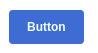

# Button

## Using



```vue

<template>
  <flu-button color="primary">
    Button
  </flu-button>
</template>

<script>
import {FluButton} from '@estudiophp/fluvue-framework'

export default {
  components: {FluButton}
}
</script>
```

## API

| Property | Type | Description |
| --- | --- | --- |
| color | String | Set component color |
| block | Boolean | Expand Button |
| type | String | Set component type |
| disabled | Boolean | Enable the disabled |
