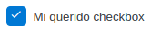

# Checkbox

## Using



```vue

<template>
  <flu-checkbox
    checked
    label="Mi querido checkbox"
    v-model="checkModel"
  ></flu-checkbox>
</template>

<script>
import {FluCheckbox} from '@estudiophp/fluvue-framework'
import {ref} from 'vue'

export default {
  components: {FluCheckbox},
  setup() {
    const checkModel = ref('')

    return {checkModel}
  }
}
</script>
```

## API

| Property | Type | Description |
| --- | --- | --- |
| label | String | Add label to checkbox |
| readonly | Boolean | Change component to readonly |
| checked | Boolean | Change value checked |
