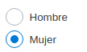

# Choice Group

## Using



```vue

<template>
  <flu-choice-group
    name="Sexo"
    v-model="choiceModel"
    defaultValue="mujer"
    :options="[
      {
        label: 'Hombre',
         value: 'hombre'
      },
      {
        label: 'Mujer',
        value: 'mujer'
      }
    ]"
  ></flu-choice-group>
</template>

<script>
import {FluChoiceGroup} from '@estudiophp/fluvue-framework'
import {ref} from 'vue'

export default {
  components: {FluChoiceGroup},
  setup() {
    const choiceModel = ref('')
    
    return {choiceModel}
  }
}
</script>
```

## API

| Property | Type | Description |
| --- | --- | --- |
| options | Array | Set options for choices |
| defaultValue | String | Value to set as default |
| name | String | Set name for choice group |
| readonly | Boolean | Enable readonly for choice group |
