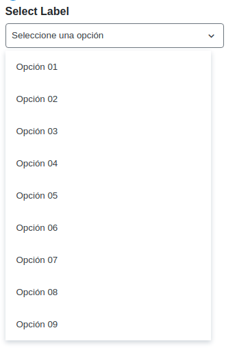

# Combo Box

## Using



```vue

<flu-combo-box
  label="Select Label"
  v-model="comboValue"
  placeholder="Seleccione una opción"
  :options="[
    { text: 'Opción 01', value: 'option01' },
    { text: 'Opción 02', value: 'option02' },
    { text: 'Opción 03', value: 'option03' },
    { text: 'Opción 04', value: 'option04' },
    { text: 'Opción 05', value: 'option05' },
    { text: 'Opción 06', value: 'option06' },
    { text: 'Opción 07', value: 'option07' },
    { text: 'Opción 08', value: 'option08' },
    { text: 'Opción 09', value: 'option09' }
  ]"
>
</flu-combo-box>

<script>
import {FluChoiceGroup} from '@estudiophp/fluvue-framework'
import {ref} from 'vue'

export default {
  components: {FluChoiceGroup},
  setup() {
    const comboValue = ref({})
    return {comboValue}
  }
}
</script>
```

## API

| Property | Type | Description |
| --- | --- | --- |
| label | String | Label for entry |
| options | Array | Options for entry |
| placeholder | String | Placeholder for entry |
| block | Boolean | Set block width |
| readonly | Boolean | Enable readonly for choice group |
